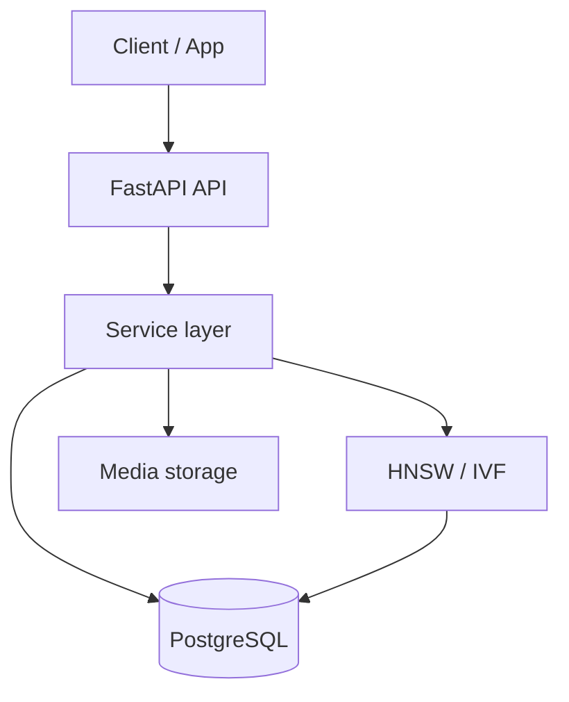

# Building Vector Database from Scratch

[](https://github.com/KunjShah95/BUILDING-MY-OWN-VECTOR-DB)
[](https://github.com/KunjShah95/BUILDING-MY-OWN-VECTOR-DB)
[](https://github.com/KunjShah95/BUILDING-MY-OWN-VECTOR-DB/blob/main/LICENSE)

A **production-ready vector database** built from scratch in Python with **FastAPI**, **PostgreSQL**, and custom **HNSW** / **IVF** indexing. The project now also supports **collections**, **text/image/audio ingest**, **multimodal search**, **RAG-friendly routes**, and **monitoring** out of the box.

> This repo is a hands-on learning project for vector search, approximate nearest neighbors, database design, multimodal retrieval, and API performance tuning.

---

[GitHub](https://github.com/KunjShah95/BUILDING-MY-OWN-VECTOR-DB) · [Docs](docs/) · [API Guide](API_INTEGRATION_GUIDE.md) · [Issues](https://github.com/KunjShah95/BUILDING-MY-OWN-VECTOR-DB/issues)

---

## Contents

- [Highlights](#highlights)
- [What it supports](#what-it-supports)
- [Quick start](#quick-start)
- [Configuration](#configuration)
- [API overview](#api-overview)
- [Architecture](#architecture)
- [Performance notes](#performance-notes)
- [Project layout](#project-layout)
- [Docker](#docker)

---

## Highlights

- FastAPI backend with automatic OpenAPI docs
- PostgreSQL-backed vector storage with SQLAlchemy models
- Custom **HNSW** and **IVF** search implementations
- Collection-scoped retrieval for text, image, and audio
- Multimodal ingestion with auto-embedding and media storage
- Vector CRUD, batch insert, search, index build/save/load, stats
- Auth, tenants, WebSocket search, RAG, streaming RAG, dashboard routes
- Prometheus metrics endpoint and structured logging
- Docker Compose and container support for local deployment

---

## What it supports

### Core vector search

- Create, read, update, delete, and batch insert vectors
- Search with `hnsw`, `ivf`, or `brute`
- Compare search methods
- Build, save, load, and inspect indexes

### Collections

- Create named collections with a stable `collection_id`
- Attach metadata such as modality, dimension, embedding model, and distance metric
- Filter search by collection
- Build per-collection HNSW indexes for collection-specific search

### Multimodal ingest and search

- Text ingest with automatic embedding
- Image ingest and search using CLIP-based embeddings
- Audio ingest and search using CPU-friendly audio embeddings
- Media file persistence and retrieval support

### Platform features

- Rate limiting
- CORS configuration
- Health and readiness checks
- Prometheus metrics
- Auth middleware
- Tenant-aware request handling
- Playground and feedback endpoints

---

## Quick start

### Prerequisites

- Python 3.9+
- PostgreSQL 12+
- PowerShell on Windows, or your shell of choice on macOS/Linux

### Install and run locally

1. Create a virtual environment.

```powershell
python -m venv .venv
& .\.venv\Scripts\Activate.ps1
```

1. Install dependencies.

```powershell
pip install -r requirements.txt
```

1. Copy `.env.example` to `.env` and adjust the values for your environment.

2. Create the database tables.

```powershell
python -c "from database.schema import Base; from config.database import engine; Base.metadata.create_all(bind=engine)"
```

1. Start the API.

```powershell
python -m uvicorn api.main:app --reload
```

### Open the app

- API: <http://localhost:8000>
- Swagger UI: <http://localhost:8000/docs>
- ReDoc: <http://localhost:8000/redoc>
- Health: <http://localhost:8000/health>

---

## Configuration

Key settings live in `.env` and map to `config/settings.py`.

### Common environment variables

- `DATABASE_URL`
- `APP_NAME`
- `APP_VERSION`
- `DEBUG`
- `DEFAULT_M`
- `DEFAULT_M0`
- `DEFAULT_EF_CONSTRUCTION`
- `DEFAULT_EF_SEARCH`
- `DEFAULT_N_CLUSTERS`
- `DEFAULT_N_PROBES`
- `DEFAULT_EMBEDDING_MODEL`
- `DEFAULT_TEXT_DIMENSION`
- `DEFAULT_IMAGE_MODEL`
- `DEFAULT_IMAGE_DIMENSION`
- `DEFAULT_AUDIO_MODEL`
- `DEFAULT_AUDIO_DIMENSION`
- `MEDIA_STORAGE_PATH`
- `RATE_LIMIT_REQUESTS`
- `RATE_LIMIT_TIME`
- `RATE_LIMIT_ENABLED`

The `.env.example` file is the best starting point for local setup.

### Project Structure

```
.
├── api/                          # FastAPI application & routes
│   └── main.py                  # Main API entry point (FastAPI app)
├── config/                      # Configuration modules
│   ├── settings.py              # App settings & parameter defaults
│   ├── database.py              # Database connection setup
│   └── logging.py               # Structured logging configuration
├── database/                    # Database layer
│   ├── schema.py                # SQLAlchemy ORM models
│   ├── vector_database.py       # Main database wrapper class
│   ├── hnsw_database.py         # HNSW-specific database operations
│   └── ivf_database.py          # IVF-specific database operations
├── models/                      # Data models
│   ├── pydantic_models.py       # API request/response schemas (Pydantic)
│   └── vector_model.py          # Vector data model & operations
├── services/                    # Business logic & service layer
│   ├── vector_service.py        # Vector CRUD operations service
│   └── vector_indexer.py        # Index management service
├── utils/                       # Utility functions & algorithms
│   ├── distance.py              # Distance metric calculations (Euclidean, cosine)
│   ├── hnsw_index.py            # HNSW algorithm implementation
│   ├── ivf_index.py             # IVF algorithm implementation
│   ├── benchmark.py             # Performance benchmarking utilities
│   ├── clustering.py            # K-means and clustering utilities
│   └── optimization.py          # Performance optimization helpers
├── scripts/                     # CLI scripts & tools
│   └── run_benchmark.py         # Automated benchmark runner
├── test/                        # Comprehensive test suite
│   ├── test_api.py              # API endpoint integration tests
│   ├── test_vector_db.py        # Database operation tests
│   ├── test_hnsw.py             # HNSW algorithm tests
│   ├── test_ivf.py              # IVF algorithm tests
│   ├── test_clustering.py       # Clustering utility tests
│   └── test_comprehensive.py    # End-to-end integration tests
├── examples/                    # Usage examples
│   ├── indexer_examples.py      # Index creation examples
│   └── vector_indexer_api.py    # API usage examples
├── docker-compose.yaml          # Multi-container orchestration
├── Dockerfile                   # Container image definition
├── prometheus.yml               # Prometheus monitoring config
├── requirements.txt             # Python package dependencies
├── HNSW_OPTIMIZATION_GUIDE.md   # Detailed optimization documentation
├── DAY1_README.md through       # Daily work progress documentation
├── DAY7_README.md               # (Learning journey documentation)
└── README.md                    # This file

```

---

## API overview

The live API includes these main groups:

- `GET /health`, `GET /ready`
- `POST /collections`, `GET /collections`, `GET /collections/{collection_id}`, `DELETE /collections/{collection_id}`
- `POST /collections/{collection_id}/index`, `GET /collections/{collection_id}/index/stats`
- `POST /collections/{collection_id}/ingest/text`
- `POST /collections/{collection_id}/ingest/image`
- `POST /collections/{collection_id}/ingest/audio`
- `POST /collections/{collection_id}/search/text`
- `POST /collections/{collection_id}/search/image`
- `POST /collections/{collection_id}/search/audio`
- `GET /media`
- `POST /vectors`, `POST /vectors/batch`, `GET /vectors`, `GET /vectors/{vector_id}`
- `PUT /vectors/{vector_id}`, `DELETE /vectors/{vector_id}`
- `POST /search`, `GET /search/compare`, `POST /search/batch`
- `POST /index`, `POST /index/save`, `POST /index/load`, `GET /index`
- `GET /stats`
- `GET /playground/templates`
- `POST /feedback`
- RAG, streaming RAG, auth, tenant, dashboard, and WebSocket routes are also mounted from `api/routers/`

### Example: create a collection and ingest text

```python
import requests

BASE = "http://localhost:8000"

requests.post(f"{BASE}/collections", json={
    "name": "Product docs",
    "collection_id": "product-docs",
    "modality": "text",
    "dimension": 384,
    "embedding_model": "sentence-transformers/all-MiniLM-L6-v2",
})

requests.post(f"{BASE}/collections/product-docs/ingest/text", json={
    "text": "Returns are accepted within 30 days with receipt.",
    "metadata": {"source": "policy"},
    "vector_id": "policy-returns",
})
```

### Example: multimodal search

```python
hits = requests.post(f"{BASE}/collections/product-docs/search/text", json={
    "query": "how do I return an item?",
    "k": 5,
    "method": "brute",
}).json()

for row in hits["results"]:
    print(row["vector_id"], row["distance"], row.get("metadata", {}).get("text"))
```

**List / get / delete** — `GET /collections`, `GET /collections/{id}`, `DELETE /collections/{id}`

> **Note:** Collection-scoped search filters by `collection_id` in PostgreSQL (brute force over the subset). Global HNSW/IVF indexes are not partitioned per collection yet; build indexes on all vectors or use `method: brute` for collection queries.

Install embeddings: `pip install 'sentence-transformers>=2.2.0,<3.0.0'`. Configure via `DEFAULT_EMBEDDING_MODEL`, `EMBEDDING_DEVICE`, and `MEDIA_STORAGE_PATH` in `.env`.

### Image & Audio (Multimodal Phase 3)

**Image collection** (CLIP `clip-ViT-B-32`, 512-dim by default):

```python
requests.post(f"{BASE}/collections", json={
    "name": "Product photos",
    "collection_id": "product-photos",
    "modality": "image",
    "dimension": 512,
})

with open("shirt.jpg", "rb") as f:
    requests.post(
        f"{BASE}/collections/product-photos/ingest/image",
        files={"file": ("shirt.jpg", f, "image/jpeg")},
        data={"metadata": '{"sku": "A1"}', "vector_id": "sku-a1"},
    )

with open("query.jpg", "rb") as f:
    hits = requests.post(
        f"{BASE}/collections/product-photos/search/image",
        files={"file": ("query.jpg", f, "image/jpeg")},
        data={"k": 5, "method": "brute"},
    ).json()
```

**Audio collection** (librosa MFCC mean-pool, 128-dim — CPU-friendly, not wav2vec2):

```python
requests.post(f"{BASE}/collections", json={
    "name": "Voice clips",
    "collection_id": "voice-clips",
    "modality": "audio",
    "dimension": 128,
})

with open("clip.wav", "rb") as f:
    requests.post(
        f"{BASE}/collections/voice-clips/ingest/audio",
        files={"file": ("clip.wav", f, "audio/wav")},
    )
```

**Multimodal collection** (`modality: multimodal`, dimension 512): shared CLIP space for text + image ingest. Audio ingest is not supported in multimodal collections (use an `audio` collection).

Environment knobs: `DEFAULT_IMAGE_MODEL`, `DEFAULT_AUDIO_MODEL`, `DEFAULT_IMAGE_DIMENSION`, `DEFAULT_AUDIO_DIMENSION`, `MEDIA_STORAGE_PATH`, `AUDIO_SAMPLE_RATE`, `AUDIO_MAX_DURATION_SEC`.

### Python SDK

```bash
pip install -e sdk
```

```python
from vector_db_client import VectorDBClient

client = VectorDBClient("http://localhost:8000")
client.collections.create(
    name="Photos", collection_id="photos", modality="image", dimension=512
)
client.multimodal.ingest_image("photos", path="cat.jpg")
print(client.multimodal.search_text("docs", "returns policy"))  # text collections
client.close()
```

See `sdk/README.md` for the full client API.

### Authentication & API Key Management

The API uses key-based authentication. Manage keys via the auth endpoints.

**Create an API Key** — `POST /api/keys/create`

```python
response = requests.post(
    "http://localhost:8000/api/keys/create",
    params={"collection_id": "docs", "name": "my-key", "permissions": "read_write"},
)
print(response.json())
```

**Revoke an API Key** — `DELETE /api/keys/revoke`

```python
requests.delete("http://localhost:8000/api/keys/revoke", params={"api_key": "sk-..."})
```

**List Keys for a Collection** — `GET /api/keys/list/{collection_id}`

```python
requests.get("http://localhost:8000/api/keys/list/docs")
```

Keys are stored as SHA-256 hashes. Always use HTTPS in production.

### Dashboard Endpoints

Real-time cluster overview at `/dashboard`.

**Stats** — `GET /api/dashboard/stats`

```python
stats = requests.get("http://localhost:8000/api/dashboard/stats").json()
print(stats["stats"]["total_vectors"], "vectors across", stats["stats"]["total_collections"], "collections")
```

**Latency** — `GET /api/dashboard/latency`

```python
latency = requests.get("http://localhost:8000/api/dashboard/latency").json()
print(f"Avg query latency: {latency['latency']['avg_ms']}ms")
```

**Index Info** — `GET /api/dashboard/index-info`

```python
info = requests.get("http://localhost:8000/api/dashboard/index-info").json()
print("HNSW loaded:", info["index_info"]["hnsw_loaded"])
```

### Streaming RAG & LLM

The streaming endpoint uses Server-Sent Events to stream RAG responses token-by-token.

**Stream RAG Query** — `GET /collections/{collection_id}/query/stream?query=...&k=5`

```python
import httpx
with httpx.Client() as client:
    with client.stream("GET", "http://localhost:8000/collections/docs/query/stream",
                       params={"query": "What is the return policy?", "k": 3}) as resp:
        for chunk in resp.iter_text():
            print(chunk, end="")
```

**Generic LLM Stream** — `POST /llm/stream`

```python
response = requests.post(
    "http://localhost:8000/llm/stream",
    json={"messages": [{"role": "user", "content": "Hello"}], "model": "gpt-4o-mini"},
    stream=True,
)
for line in response.iter_lines():
    print(line)
```

### Hybrid Search & Reranking

Combine dense vector search with sparse BM25 via Reciprocal Rank Fusion.

**Hybrid Search** — `POST /collections/{collection_id}/search/hybrid`

```python
hybrid = requests.post(
    f"http://localhost:8000/collections/docs/search/hybrid",
    json={"query": "return policy", "k": 10, "alpha": 0.5},
).json()
```

**Search + Cross-Encoder Rerank** — `POST /collections/{collection_id}/search/rerank`

```python
reranked = requests.post(
    f"http://localhost:8000/collections/docs/search/rerank",
    json={"query": "return policy", "k": 5},
).json()
for hit in reranked["results"]:
    print(hit["vector_id"], hit["distance"])
```

**Build Sparse Index** — `POST /collections/{collection_id}/index/sparse`

```python
requests.post(f"http://localhost:8000/collections/docs/index/sparse")
```

### PQ Index Usage

Product Quantization compresses vectors for memory-efficient search.

**Build a PQ index** — `POST /index` with `"method": "pq"`

```python
pq = requests.post("http://localhost:8000/index", json={"method": "pq"}).json()
print(pq["stats"]["compression_ratio"], ":1 compression")
```

**Search with PQ** — `POST /search` with `"method": "pq"`

```python
results = requests.post("http://localhost:8000/search", json={
    "query_vector": [0.1, 0.2, 0.3, 0.4],
    "k": 10,
    "method": "pq",
}).json()
```

**Save / Load PQ** — `POST /index/save?method=pq` and `POST /index/load?method=pq`

### gRPC API

An optional gRPC server is available alongside the REST API.

**Start the server:**
```powershell
python -m api.grpc.server
```
Listens on `0.0.0.0:50051` by default.

**Available RPCs:**
| RPC | Description |
|-----|-------------|
| `Search` | Vector similarity search |
| `Insert` | Insert a single vector |
| `BatchInsert` | Batch vector insertion |
| `Delete` | Delete a vector |
| `GetVector` | Get vector by ID |
| `ListCollections` | List all collections |
| `Health` | Health check |

Install the gRPC dependency:
```powershell
pip install grpcio
```

Generate Python stubs from `api/grpc/vector_service.proto`:
```powershell
python -m grpc_tools.protoc -Iapi/grpc --python_out=api/grpc --grpc_python_out=api/grpc api/grpc/vector_service.proto
```

> **Note:** The gRPC server delegates to the same `VectorService` used by the REST API.

### Roadmap / What more can be worked upon

- Per-collection HNSW indexes (**implemented** — `POST /collections/{id}/index`, on-disk under `indexes/{id}/`; per-collection IVF still TODO)
- Cross-modal CLIP text→image search quality tuning and unified multimodal audio
- Long-audio chunking and segment-level vectors
- Object storage (S3/Azure Blob) instead of local `MEDIA_STORAGE_PATH`
- Async ingest job queue for large uploads
- gRPC / GraphQL APIs alongside REST
- SQL/metadata filters (JSONB), hybrid dense + sparse search
- Vector quantization and int8 indexes for scale
- Multi-tenant auth, API keys per collection, rate limits

### System Operations

#### **Get Statistics**

**GET** `/stats`

```python
response = requests.get("http://localhost:8000/stats")
stats = response.json()
print(f"Total Vectors: {stats['total_vectors']}")
print(f"Index Built: {stats['index_built']}")
```

#### **Health Check**

**GET** `/health`

```python
response = requests.get("http://localhost:8000/health")
health = response.json()
print(f"Status: {health['status']}")
print(f"Database: {health['database']}")
```

---

## Architecture

### Layers

- **API layer**: `api/` contains FastAPI routes, middleware, and mounted routers
- **Service layer**: `services/` handles collections, embeddings, ingest, search, and index orchestration
- **Database layer**: `database/` defines SQLAlchemy models and persistence wrappers
- **Algorithms**: `utils/` contains HNSW, IVF, distance, optimization, and metadata helpers
- **Models**: `models/` contains request/response schemas
- **Examples and SDK**: `examples/` and `sdk/` show how to use the API

### Runtime flow


```mermaid
graph TB
    Client[Client / App]
    API[FastAPI API]
    Services[Service layer]
    DB[(PostgreSQL)]
    Indexes[HNSW / IVF]
    Media[Media storage]

    Client --> API
    API --> Services
    Services --> DB
    Services --> Indexes
    Services --> Media
    Indexes --> DB
```

---

## Performance notes

The repo includes benchmark artifacts for HNSW tuning on a 10,000-vector dataset.

### Benchmark snapshot

- Average recall: **0.981**
- Average precision: **0.999**
- Average F1: **0.983**
- Average query time: **0.129 s**
- Queries per second: **4.46 qps**

These numbers are from the saved benchmark reports in the repository and are useful for regression comparisons when tuning `m`, `ef_construction`, and `ef_search`.

---

## Project layout

```text
.
├── api/                  # FastAPI app, middleware, routers
├── config/               # Settings, DB, and logging config
├── database/             # SQLAlchemy models and DB wrappers
├── docs/                 # Guides and write-ups
├── examples/             # Example clients and demos
├── indexes/              # Stored per-collection index artifacts
├── models/               # Pydantic request/response models
├── scripts/              # Benchmark and utility scripts
├── sdk/                  # Reusable client package
├── services/             # Core business logic
├── terraform/            # Infrastructure templates
├── test/                 # Test suite
├── utils/                # Algorithms and helper utilities
├── docker-compose.yaml   # Local multi-container setup
├── dockerfile            # Container image
├── prometheus.yml        # Prometheus config
└── requirements.txt      # Python dependencies
```

---

## Docker

Use Docker Compose for a local stack with the API and PostgreSQL.

```powershell
docker compose up --build
```

If you prefer a separate build, use the repository `dockerfile` directly.

---

## Notes

- `main.py` is a demo script that shows how to create vectors, build an index, and run sample searches.
- The API root (`GET /`) returns the app name, version, docs path, and health path.
- Collection-scoped IVF search is not implemented yet; collection search currently falls back to HNSW or brute force depending on index availability.

If you want, I can also update the README to include badges, diagrams, or a more polished “marketing-style” intro next.
