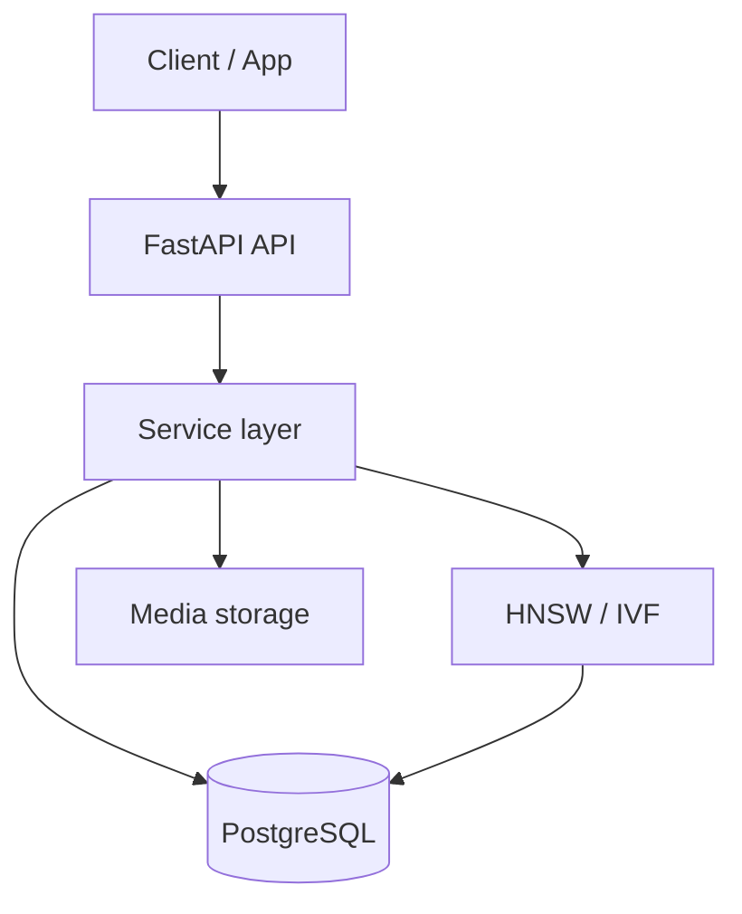

# Building Vector Database from Scratch

[](https://github.com/KunjShah95/BUILDING-MY-OWN-VECTOR-DB)
[](https://github.com/KunjShah95/BUILDING-MY-OWN-VECTOR-DB)
[](https://github.com/KunjShah95/BUILDING-MY-OWN-VECTOR-DB/blob/main/LICENSE)

A **production-ready vector database** built from scratch in Python with **FastAPI**, **PostgreSQL**, and custom **HNSW** / **IVF** indexing. The project now also supports **collections**, **text/image/audio ingest**, **multimodal search**, **RAG-friendly routes**, and **monitoring** out of the box.

> This repo is a hands-on learning project for vector search, approximate nearest neighbors, database design, multimodal retrieval, and API performance tuning.

---

[GitHub](https://github.com/KunjShah95/BUILDING-MY-OWN-VECTOR-DB) · [Docs](docs/) · [API Guide](API_INTEGRATION_GUIDE.md) · [Issues](https://github.com/KunjShah95/BUILDING-MY-OWN-VECTOR-DB/issues)

---

## Contents

- [Highlights](#highlights)
- [What it supports](#what-it-supports)
- [Quick start](#quick-start)
- [Configuration](#configuration)
- [API overview](#api-overview)
- [Architecture](#architecture)
- [Performance notes](#performance-notes)
- [Project layout](#project-layout)
- [Docker](#docker)

---

## Highlights

- FastAPI backend with automatic OpenAPI docs
- PostgreSQL-backed vector storage with SQLAlchemy models
- Custom **HNSW** and **IVF** search implementations
- Collection-scoped retrieval for text, image, and audio
- Multimodal ingestion with auto-embedding and media storage
- Vector CRUD, batch insert, search, index build/save/load, stats
- Auth, tenants, WebSocket search, RAG, streaming RAG, dashboard routes
- Prometheus metrics endpoint and structured logging
- Docker Compose and container support for local deployment

---

## What it supports

### Core vector search

- Create, read, update, delete, and batch insert vectors
- Search with `hnsw`, `ivf`, or `brute`
- Compare search methods
- Build, save, load, and inspect indexes

### Collections

- Create named collections with a stable `collection_id`
- Attach metadata such as modality, dimension, embedding model, and distance metric
- Filter search by collection
- Build per-collection HNSW indexes for collection-specific search

### Multimodal ingest and search

- Text ingest with automatic embedding
- Image ingest and search using CLIP-based embeddings
- Audio ingest and search using CPU-friendly audio embeddings
- Media file persistence and retrieval support

### Platform features

- Rate limiting
- CORS configuration
- Health and readiness checks
- Prometheus metrics
- Auth middleware
- Tenant-aware request handling
- Playground and feedback endpoints

---

## Quick start

### Prerequisites

- Python 3.9+
- PostgreSQL 12+
- PowerShell on Windows, or your shell of choice on macOS/Linux

### Install and run locally

1. Create a virtual environment.

```powershell
python -m venv .venv
& .\.venv\Scripts\Activate.ps1
```

1. Install dependencies.

```powershell
pip install -r requirements.txt
```

1. Copy `.env.example` to `.env` and adjust the values for your environment.

2. Create the database tables.

```powershell
python -c "from database.schema import Base; from config.database import engine; Base.metadata.create_all(bind=engine)"
```

1. Start the API.

```powershell
python -m uvicorn api.main:app --reload
```

### Open the app

- API: <http://localhost:8000>
- Swagger UI: <http://localhost:8000/docs>
- ReDoc: <http://localhost:8000/redoc>
- Health: <http://localhost:8000/health>

---

## Configuration

Key settings live in `.env` and map to `config/settings.py`.

### Common environment variables

- `DATABASE_URL`
- `APP_NAME`
- `APP_VERSION`
- `DEBUG`
- `DEFAULT_M`
- `DEFAULT_M0`
- `DEFAULT_EF_CONSTRUCTION`
- `DEFAULT_EF_SEARCH`
- `DEFAULT_N_CLUSTERS`
- `DEFAULT_N_PROBES`
- `DEFAULT_EMBEDDING_MODEL`
- `DEFAULT_TEXT_DIMENSION`
- `DEFAULT_IMAGE_MODEL`
- `DEFAULT_IMAGE_DIMENSION`
- `DEFAULT_AUDIO_MODEL`
- `DEFAULT_AUDIO_DIMENSION`
- `MEDIA_STORAGE_PATH`
- `RATE_LIMIT_REQUESTS`
- `RATE_LIMIT_TIME`
- `RATE_LIMIT_ENABLED`

The `.env.example` file is the best starting point for local setup.

---

## API overview

The live API includes these main groups:

- `GET /health`, `GET /ready`
- `POST /collections`, `GET /collections`, `GET /collections/{collection_id}`, `DELETE /collections/{collection_id}`
- `POST /collections/{collection_id}/index`, `GET /collections/{collection_id}/index/stats`
- `POST /collections/{collection_id}/ingest/text`
- `POST /collections/{collection_id}/ingest/image`
- `POST /collections/{collection_id}/ingest/audio`
- `POST /collections/{collection_id}/search/text`
- `POST /collections/{collection_id}/search/image`
- `POST /collections/{collection_id}/search/audio`
- `GET /media`
- `POST /vectors`, `POST /vectors/batch`, `GET /vectors`, `GET /vectors/{vector_id}`
- `PUT /vectors/{vector_id}`, `DELETE /vectors/{vector_id}`
- `POST /search`, `GET /search/compare`, `POST /search/batch`
- `POST /index`, `POST /index/save`, `POST /index/load`, `GET /index`
- `GET /stats`
- `GET /playground/templates`
- `POST /feedback`
- RAG, streaming RAG, auth, tenant, dashboard, and WebSocket routes are also mounted from `api/routers/`

### Example: create a collection and ingest text

```python
import requests

BASE = "http://localhost:8000"

requests.post(f"{BASE}/collections", json={
    "name": "Product docs",
    "collection_id": "product-docs",
    "modality": "text",
    "dimension": 384,
    "embedding_model": "sentence-transformers/all-MiniLM-L6-v2",
})

requests.post(f"{BASE}/collections/product-docs/ingest/text", json={
    "text": "Returns are accepted within 30 days with receipt.",
    "metadata": {"source": "policy"},
    "vector_id": "policy-returns",
})
```

### Example: multimodal search

```python
hits = requests.post(f"{BASE}/collections/product-docs/search/text", json={
    "query": "how do I return an item?",
    "k": 5,
    "method": "brute",
}).json()

for row in hits["results"]:
    print(row["vector_id"], row["distance"])
```

---

## Architecture

### Layers

- **API layer**: `api/` contains FastAPI routes, middleware, and mounted routers
- **Service layer**: `services/` handles collections, embeddings, ingest, search, and index orchestration
- **Database layer**: `database/` defines SQLAlchemy models and persistence wrappers
- **Algorithms**: `utils/` contains HNSW, IVF, distance, optimization, and metadata helpers
- **Models**: `models/` contains request/response schemas
- **Examples and SDK**: `examples/` and `sdk/` show how to use the API

### Runtime flow


```mermaid
graph TB
    Client[Client / App]
    API[FastAPI API]
    Services[Service layer]
    DB[(PostgreSQL)]
    Indexes[HNSW / IVF]
    Media[Media storage]

    Client --> API
    API --> Services
    Services --> DB
    Services --> Indexes
    Services --> Media
    Indexes --> DB
```

---

## Performance notes

The repo includes benchmark artifacts for HNSW tuning on a 10,000-vector dataset.

### Benchmark snapshot

- Average recall: **0.981**
- Average precision: **0.999**
- Average F1: **0.983**
- Average query time: **0.129 s**
- Queries per second: **4.46 qps**

These numbers are from the saved benchmark reports in the repository and are useful for regression comparisons when tuning `m`, `ef_construction`, and `ef_search`.

---

## Project layout

```text
.
├── api/                  # FastAPI app, middleware, routers
├── config/               # Settings, DB, and logging config
├── database/             # SQLAlchemy models and DB wrappers
├── docs/                 # Guides and write-ups
├── examples/             # Example clients and demos
├── indexes/              # Stored per-collection index artifacts
├── models/               # Pydantic request/response models
├── scripts/              # Benchmark and utility scripts
├── sdk/                  # Reusable client package
├── services/             # Core business logic
├── terraform/            # Infrastructure templates
├── test/                 # Test suite
├── utils/                # Algorithms and helper utilities
├── docker-compose.yaml   # Local multi-container setup
├── dockerfile            # Container image
├── prometheus.yml        # Prometheus config
└── requirements.txt      # Python dependencies
```

---

## Docker

Use Docker Compose for a local stack with the API and PostgreSQL.

```powershell
docker compose up --build
```

If you prefer a separate build, use the repository `dockerfile` directly.

---

## Notes

- `main.py` is a demo script that shows how to create vectors, build an index, and run sample searches.
- The API root (`GET /`) returns the app name, version, docs path, and health path.
- Collection-scoped IVF search is not implemented yet; collection search currently falls back to HNSW or brute force depending on index availability.

If you want, I can also update the README to include badges, diagrams, or a more polished “marketing-style” intro next.
